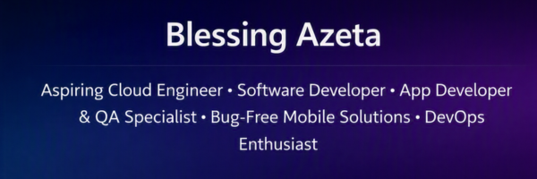
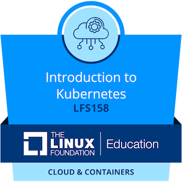
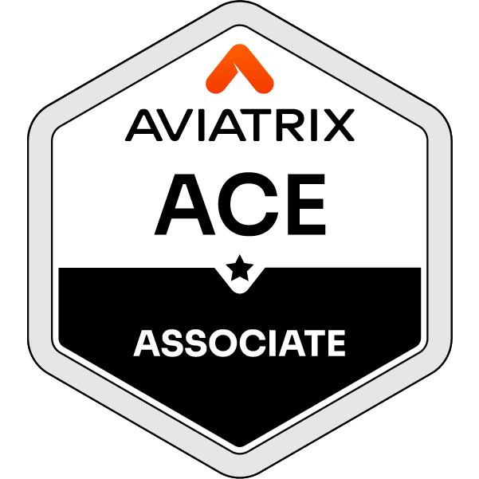
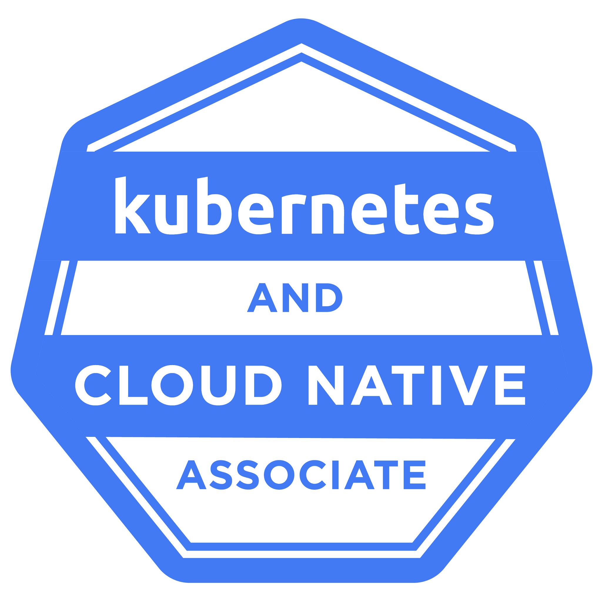
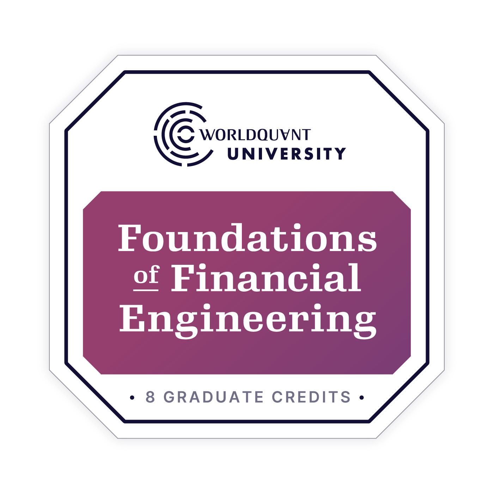
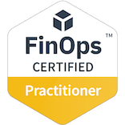

<h1 align="center">
  

---
### 💬 About Me
- 🌱 Currently learning **Cloud (Azure), DevOps, DevSecOps, and Go** — mastering VMs, App Services, CI/CD, Kubernetes, and Terraform  
- 🚀 Working on **Blazeworld** (Flask e-commerce app on Azure), **StudyPal by Blaze** (offline-first exam prep Android app), and **Wealth Habits** (financial literacy app for Nigerians)  
- 🤝 Open to collaboration on **Cloud, DevOps, and Android/mobile app projects**  
- 💬 Ask me about **Cloud, Linux, DevOps, DevSecOps, or building apps in Google AI Studio**  
- 🎯 Goal: Become a **Cloud & DevOps / Site Reliability Engineer**  
- 📫 Reach me at **azetablessingb@gmail.com** or **azetablessing@outlook.com**

---

### 🤝 Connect with me

  
  
  

---

### 🚀 Skills

---

### 🌟 Featured Projects

**[Blazeworld](https://github.com/Azeta-Insights/Blazeworld)** — Flask e-commerce app deployed on Azure App Service.

**[StudyPal by Blaze](https://github.com/Azeta-Insights/StudyPal)** — Offline-first WAEC/JAMB/NECO exam-prep Android app.

**[Wealth Habits](https://github.com/Azeta-Insights/Wealth-Habits)** — Financial literacy app for Nigerians tied to real transaction data.

---

### 🏅 Certifications
| Certification | Issuing Organization | Date |
|---------------|----------------------|------|
| Microsoft Azure Fundamentals (AZ-900) | Microsoft | Jan 2026 |
| AWS Cloud Practitioner | AWS | Feb 2026 |
| Kubernetes and Cloud Native Associate (KCNA) | CNCF | Apr 2026 |
| Introduction to Kubernetes (LFS158) | Linux Foundation | May 2026 |
| Aviatrix Certified Engineer (ACE Associate) | Aviatrix | Jun 2026 |
| Foundations of Financial Engineering | WorldQuant University | Nov 2025 |
| FinOps Certified Practitioner | FinOps Foundation | May 2026 |
| DevSecOps Essentials (DISE) | EC-Council | Apr 2026 |

---

### 🎯 Badges

---

---

---

---

### 🎯 Goals
- ✅ Build 10 real-world cloud projects
- ✅ Contribute to Open Source
- ✅ Earn Cloud Certifications
- ✅ Learn Kubernetes
- ✅ Improve Linux Skills
- ✅ Land a Cloud Engineering Role

---

⭐ Thank you for visiting my profile! ⭐

